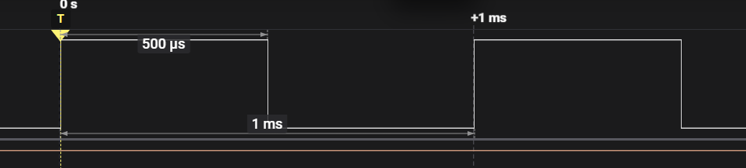

# STM32 DWT Microsecond Delay Library

> **"Time is nothing but a count of cycles."** - Embedded Expert Team

这是一个基于 Cortex-M 内核 **DWT (Data Watchpoint and Trace)** 单元实现的微秒级延时库。

## 🎯 为什么选择这个方案？

1. **极简主义**：不占用任何硬件定时器 (TIMx)，把宝贵的定时器留给 PWM 或电机控制。
2. **全平台兼容**：支持 STM32F1, F4, F7, H7, G4 等所有带 DWT 的 Cortex-M3/M4/M7 核。
   - *注意：Cortex-M0 (如 STM32F0/L0) 没有 DWT，此库不适用！*
3. **高精度**：直接基于 CPU 主频计数，精度高达 1/SystemCoreClock 秒。
4. **RTOS 友好**：提供了 `delay_smart_us`，在长延时时自动切换为 RTOS 挂起，避免死等浪费 CPU。

## 🛠️ 如何集成

1. 将 `delay_us.c` 和 `delay_us.h` 复制到你的工程目录（如 `Core/Src` 和 `Core/Inc`，或者我们建议的 `Core/delay/`）。

2. 在 `main.c` 中包含头文件：

   ```
   #include "delay_us.h"
   ```

3. **关键步骤**：在时钟初始化之后，**必须**调用一次初始化函数：

   ```
   /* System Clock Config */
   SystemClock_Config(); 
   
   /* Delay Init */
   delay_init(); // ⚠️ 必须在时钟配置后调用，否则 SystemCoreClock 变量不正确
   ```

## ⚙️ FreeRTOS 适配指南

如果你正在使用 FreeRTOS，请在 `delay_us.h` 中解开宏定义的注释，或者在 IDE 的预处理符号中添加 `USE_FREERTOS`。

```
// delay_us.h
#define USE_FREERTOS  // <--- 取消注释
```

此时你可以使用 `delay_smart_us(us)`：

- **< 2000us**: 执行 DWT 忙等待（保证时序精度，如驱动 DHT11, WS2812）。
- **>= 2000us**: 执行 `vTaskDelay`（释放 CPU 给低优先级任务）。

## ⚠️ 避坑指南 (专家经验)

1. STM32H7 开发者注意：

   H7 的主频非常高 (400MHz+)，且有时钟域划分。确保 SystemCoreClock 变量确实反映了 CPU 的时钟频率（通常 HAL 库会自动更新，但要在 SystemClock_Config 后调用 delay_init）。

2. 32位溢出问题：

   DWT 是 32 位计数器。

   - F1 (72MHz): 约 59 秒溢出。

   - H7 (480MHz): 约 9 秒溢出。

     代码中已利用无符号减法处理了回绕，只要单次延时不超过溢出时间，都是安全的。

3. 调试模式下的坑：

   有些调试器在断点暂停时会停止 DWT 计数，有些则不会。如果在调试时发现延时时间不对，请检查调试器设置中的 "Trace" 选项。

4. 超短延时与函数开销：

   调用 delay_us(1) 可能实际产生了 1.5us 的延时，因为函数入栈出栈和计算也需要几十个时钟周期。这是纳秒级精度的物理极限，通常可以忽略。如果需要极致精准（比如模拟 USB 时序），请使用汇编内联。

   # 应用图片

   

```c
void LED_Task(void const * argument)
{
  /* USER CODE BEGIN LED_Task */
  /* Infinite loop */
  for(;;)
  {
    for(int i = 0; i < 20; i++) {
        HAL_GPIO_TogglePin(us_Debug_GPIO_Port, us_Debug_Pin);
        delay_smart_us(500);
    }
  }
  /* USER CODE END LED_Task */
}
```

